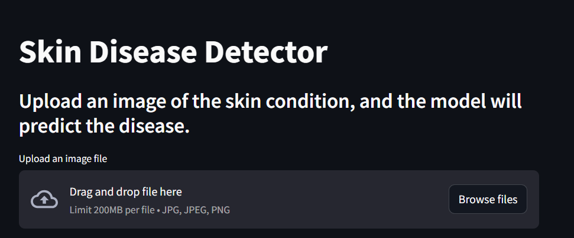

# 🧬 Skin Disease Detector using Deep Learning & Streamlit

A deep learning-powered web application that detects **8 common skin diseases** from an uploaded image using a pre-trained **Convolutional Neural Network (CNN)**. Built with **TensorFlow/Keras** and **Streamlit**, the app provides real-time predictions along with diagnosis information like description, medications, and precautions.

---

## 📸 App Preview

  
   
  <i>Fig 1: Streamlit Interface for Skin Disease Detection</i>

---

## 🦠 Supported Skin Diseases

The model is trained to identify the following skin conditions:

- ✅ Cellulitis  
- ✅ Impetigo  
- ✅ Athlete's Foot  
- ✅ Nail Fungus  
- ✅ Ringworm  
- ✅ Cutaneous Larva Migrans  
- ✅ Chickenpox  
- ✅ Shingles  

Each prediction includes:
- 🔍 Confidence Score
- 📖 Disease Description
- 💊 Medications
- 🛡️ Precautions

---

## 🧪 Demo Output

  
   
  <i>Fig 2: Output with prediction, description, and medical suggestions</i>

---

## 🧠 How It Works

1. 📤 User uploads an image of a skin condition.  
2. 🧼 The image is resized and normalized.  
3. 🧠 The CNN model predicts the disease.  
4. 🩺 The app displays a prediction with helpful medical information.

---

## ⚠️ Disclaimer

> This tool is for **educational and research purposes only** and is **not a substitute for professional medical diagnosis or treatment**.  
> Always consult a licensed dermatologist for medical advice.

---

## 🛠 Future Features

- 📷 Webcam-based image input  
- 📊 Track patient history and generate PDF reports  
- 🌐 Multi-language support  
- ☁️ Deploy to cloud platforms like Heroku or Streamlit Cloud  

---

## 🤝 Contributing

Contributions are welcome! Feel free to:

- 🍴 Fork the repository  
- 🛠 Create a new branch  
- 🔁 Submit a pull request  

---

## 📜 License

This project is licensed under the **MIT License**.

---

## 🔗 Connect

- 📫 Email: [karthikchitti55@gmail.com](mailto:karthikchitti55@gmail.com)  
- 🌐 GitHub: [github.com/karthikch2630](https://github.com/karthikch2630)

